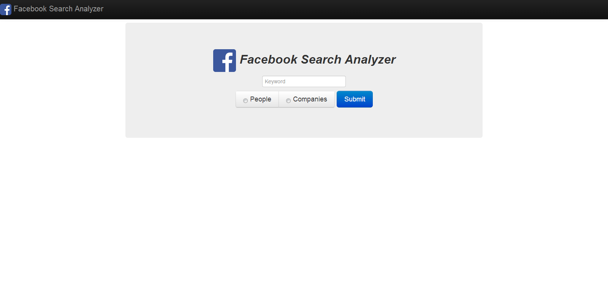
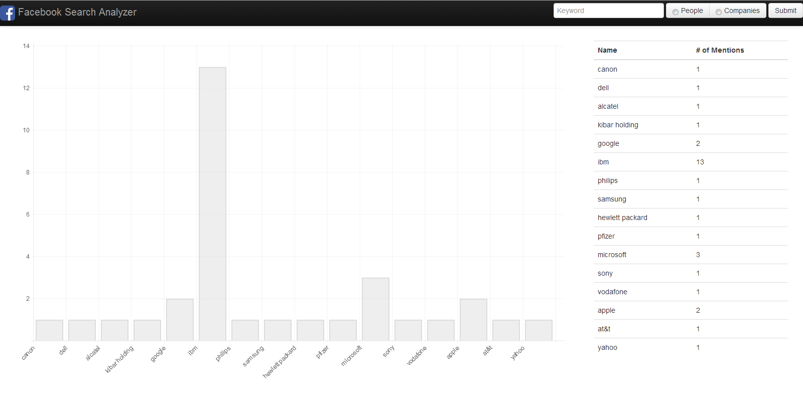

# How to Run and Deploy the Facebook Search Analyzer #

## Prerequisites ##

Before we begin, we first need to install the command line tool that will be used to upload and manage your application. Cloud Foundry uses a tool called [**cf**](https://github.com/cloudfoundry/cf). This tool is written in Ruby, so you must have Ruby installed. If you are running on Windows, you can install Ruby from [this](http://rubyinstaller.org/downloads/) website. 

For Linux systems, consult your documentation for how to install the **ruby** package - for Ubuntu the command:

		apt-get install ruby

should work for you.

Once Ruby is installed, cf can be installed by using the **gem install** command:
        
		gem install cf
        
## Download the App ##

The source for this app is at GitHub so, for example, if you are using the command line you can clone the repository like this:

		git clone https://github.com/ibmjstart/bluemix-java-facebook-search.git
		
If you want to use Eclipse to work on it, there are two ways you can get the source into Eclipse:

1. Import the Eclipse project by following these instructions:
	1. Start by cloning the repository, as described above
	2. Open Eclipse
	3. Select File->Import
	4. Under the header labeled "General", click "Existing Projects Into Workspace" and click Next
	5. Click "Browse" next to the first text field, and navigate to the cloned repository and find the folder labeled "app" and click ok.
	6. Under Projects you should now see a project called "FacebookSearch", make sure the checkbox next to the "FacebookSearch" project is checked and then click "Finish
	7. You should now see the "FacebookSearch" project in your list of projects in Eclipse.

2. Import the WAR File
	1. Navigate to https://github.com/ibmjstart/bluemix-java-facebook-search/releases
	2. Click the green button labeled "FacebookSearch.war" and that will download the WAR file.
	3. Open Eclipse
	4. Then File->Import
	5. Scroll down to the "Web" section, expand that section and click WAR File then click Next.
	6. Click next and then Finish and the project should be imported into Eclipse

## Overview of the app ##

This is a Java app that uses the following cloud services:

-	Company Text Analytics Service
-   Name Text Analytics Service

## External and Public APIs ###

This app uses some external APIs. You need to register the app with Facebook to get the keys and tokens.

### Facebook Graph API ###

To access the [Facebook Graph API](https://developers.facebook.com/docs/getting-started/graphapi/) you need your App ID and App Secret, so you must register the app with Facebook. You can register your app [here](https://developers.facebook.com/).

[More information on how to register the app with Facebook](registerFacebook.md)

### Chart.js ###

The graph is generated using the Chart.js library, which is under MIT license. The Chart.js library has been included with the app. The library is located in the WebContent/js folder in the WAR file. 

## Deploying the App ##

Once you have included the Facebook App ID and App Secret as shown above, you are all set to deploy the app. In the terminal, go in the directory of the app. The application is wrapped in a WAR file. You can directly deploy/push the WAR file using push command:

		cf push

Just follow the instructions on the screen. You can select the default settings for deploying the app, i.e. for URL, memory reservations (512 Recommended), number of instances. You need to bind the Company Text Analytics Service and Name Text Analytics Service to your application. 

### Binding a Service to Your App ###

For the app to function correctly, you must create the service instance and bind the service instance while deploying the app. The **cf push** command will ask, "Create services for application?" Answer yes, then you will be presented with a list of services. Choose Company Text analytics service and Names Text Analytics Service from this list. Below, you can see some screenshots of what this should look like when deploying from the command line.

Here are some snapshots of how to deploy the app and create services required for the app: 
    
(These are to be added)

After the application is deployed using **cf push**, you can check the status of the app using the following command: **cf apps**. If the status is RUNNING, you can hit the URL in the browser and see the application is running.

## Troubleshooting ##

-   Sometimes your app may not work as expected and debugging needs to be done. The cf command line tool can be used to assist with debugging. With the cf you can check your app's logs by typing the command **cf logs [app_name]** 
-   When you first start using the cf tool, you may potentially have trouble logging in due to no target being set. To view the target that is set, type **cf target** and if you want to set a new target type **cf target [target_url]**. Note: The target URL will usually be in the form of http://api.xxx.tld
-   From time to time your app may stop working, this means it could require a restart. To do this you must first stop it by typing **cf stop**. Once the app has been stopped, you can type **cf start** and if there are no other problems your app should start. 

## Screenshots ##

Here are some screenshots of what the app will look like when it is running and functioning correctly. 

